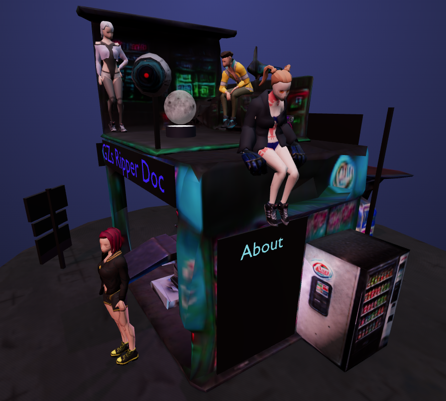

# Ripper doc

Live Link:
https://sbingley22.github.io/ripperdoc-shop-landing-page/

A landing page for a shop or similar buisness. In this example I have used a "ripper doc" shop from cyberpunk.

It features a 3D interactable shop for users to view and interact with. 
Clicking on various employees shows there name and bio. 
Clicking the signed posted "Services", "Contact", and "About" shows html pages with relevant details about the buisness.
Try clicking the woman at the front of the shop. This will allow her to try out some of the services the buisness offers.
Clicking the boombox plays music.

